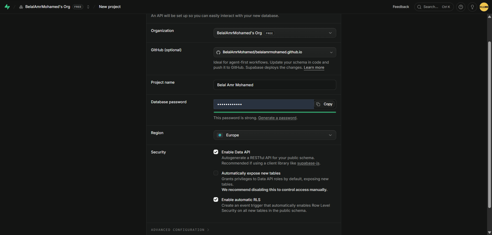

# Project Issues and Follow-up Work

## What is this file
`docs/issues.md` is were I draft my notes/ideas on updated that I'm currently doing, or things I found while testing the pages. These are mostly either fixes or new features ideas. These are drafts that changes constantly, not actual plans that are ready to be implemented. 

Issues in here have to be studies and tested well, then turned into a plan, before actually implementing it.

## Patches

### DATABASE
* I went to Supabase, and made a project with these settings: .
* I copied the environment variables from Supabase and pasted them to `.env.local` and to Vercel, too.

## New Features
الموقع ده أنا عملته عن طريق إني اخت Template مجانية ، وغيرت الصور والكلام اللي مكتوب فقط

أنا كنت عامله من سنتين تقريبا ، وأنا في سنة أولى حاسبات. دلوقتي أنا عندي قدرات اكبر بكتير وجه الوقت إني احدثه ، وآخده لمستوى تاني خالص

### لوحة تحكم
أنا عاوز اعمل لوحة تحكم ليا أنا عشان اقدر اتحكم فيها بكل اللي بيتعرف على الموقع ، وبالذات المشاريع اللي بتتعرض ، لأني بعوز إني ازودها ، ومش كل شوية هحدث الكود.

### تسجيل الدخول
لوحة التحكم المفروض يكون فيها تسجيل دخول بالإيميل ، وكمان تسجيل دخول بـ GitHub أو بـ Google
* أنا رحت لـ `https://console.cloud.google.com/auth/clients?project=belal-amr-mohamed` وعملت كل حاجة ، وكمان رحت لـ Supabase وربط كل حاجة ، لأني عملت الموضوع ده قبل كده كتير جدا ، كان سهل
* أنا رحت لـ `https://github.com/settings/applications` وعملت واحد جديد ، وكمان ربط كل حاجة بـ Supabase لأني عملت الموضوع ده قبل كده كتير برضوا
* يعني مفيش أي ربط باقي ، كله شغل كود

### موديل ذكاء اصطناعي
أنا جتب API Keys من جوجل عشان اعمل موديل ذكاء اصطناعي في الموقع
* يكون ليه وصول على قاعدة البيانات ، عشان يقدر يجاوب على أي سؤال عني
* يكون عنده معلومات عني في الـ System Prompt
* يكون عنده أدوات كتير يستخدمها
* يقدر يبعت طرق التواصل معايا في الشات نفسه (زراير ، أو حاجة أفضل)
* يقدر يبعت صورتي ومعلومات لو اتسأل عنهم
* يقدر يبعت صور وروابط أي مشروع من المشاريع اللي أنا عاملهم (بما إنه هيكون ليه وصول على قاعدة البيانات)
* هيشتغل بتقنية الـ Round Robin عشان لو الـ Credits بتاع أي API Key خلصت ؛ يدخل على الـ API Key اللي بعديه
* هيكون ليه لوجو الخاص بيه (لو مش هتعرف تعلمه ، اكتب برومبت للذكاء الإصطناعي يعمله)
* `AI_AGENT_GOOGLE_KEYS` موجود بشكل صحيح في `.env.local` و `Vercel`. API Keys مجانية من جوجل من اكتر من حساب مجاني ؛ عشان تطبق الـ Round Robin.

الربط بـ Telegram: 
* موديل الذكاء الإصطناعي ده هيكون مربوط ببوت Telegram
* هيكون عنده نفس المعلومات والأدوات والوصول اللي عند الموديل اللي هيكون في الموقع العادي.
* أنا عملت البوت على تليجرام
  * Name: Belal Amr (AI)
  * Link: t.me/BelalAmrBot
  * `TELEGRAM_BOT_TOKEN` Is set correctly in `.env.local` and in Vercel, too and is exposed to all environments.
* المفروض يكون Chat Telegram كامل ، يعني الحاجات دي المفروض تشتغل عادي:
  * Voice Messages
  * Message Replies
  * Chat Context
* ويقدر يشتغل عادي لما يكون اكتر من مستخدم بيكلموه في نفس الوقت